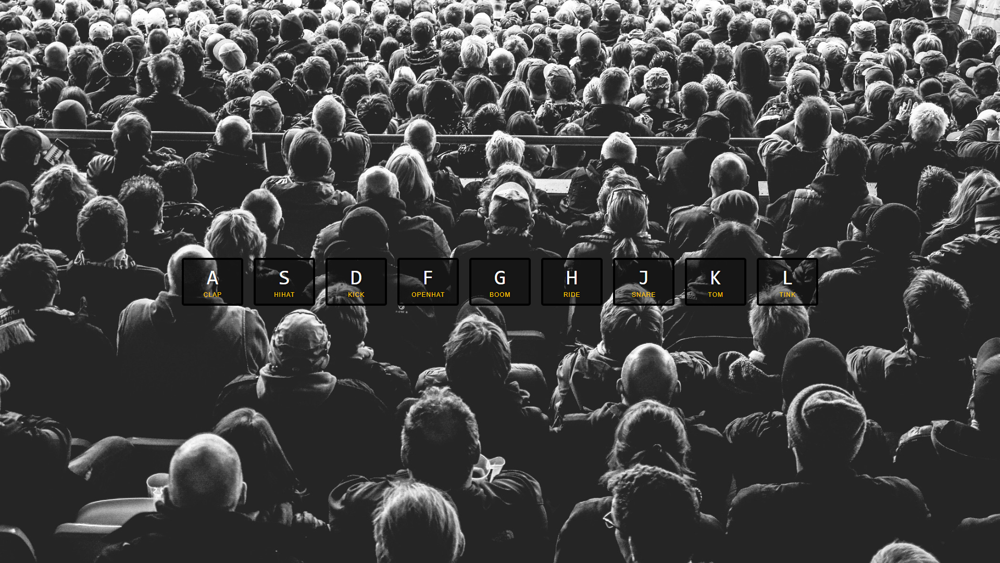

# JavaScript30-WesBos-Challenge

30 day vanilla JS coding challenge from Wes Bos

You can find the course there: [JavaScript30](https://javascript30.com)

## Screenshots

- 01 - JavaScript Drum Kit 
  
- 02 - JS and CSS Clock 
  
- 03 - CSS Variables 
  
- 04 - Array Cardio Day 1 
  
- 05 - Flex Panel Gallery 
  
- 06 - Ajax Type Ahead 
  
- 07 - Array Cardio Day 2 
  
- 08 - Fun with HTML5 Canvas 
  
- 09 - Dev Tools Domination 
  
